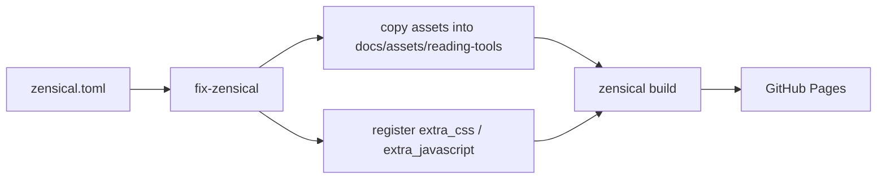
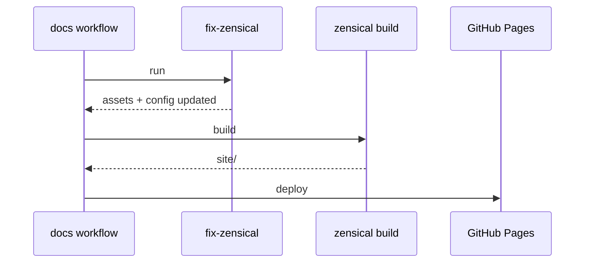
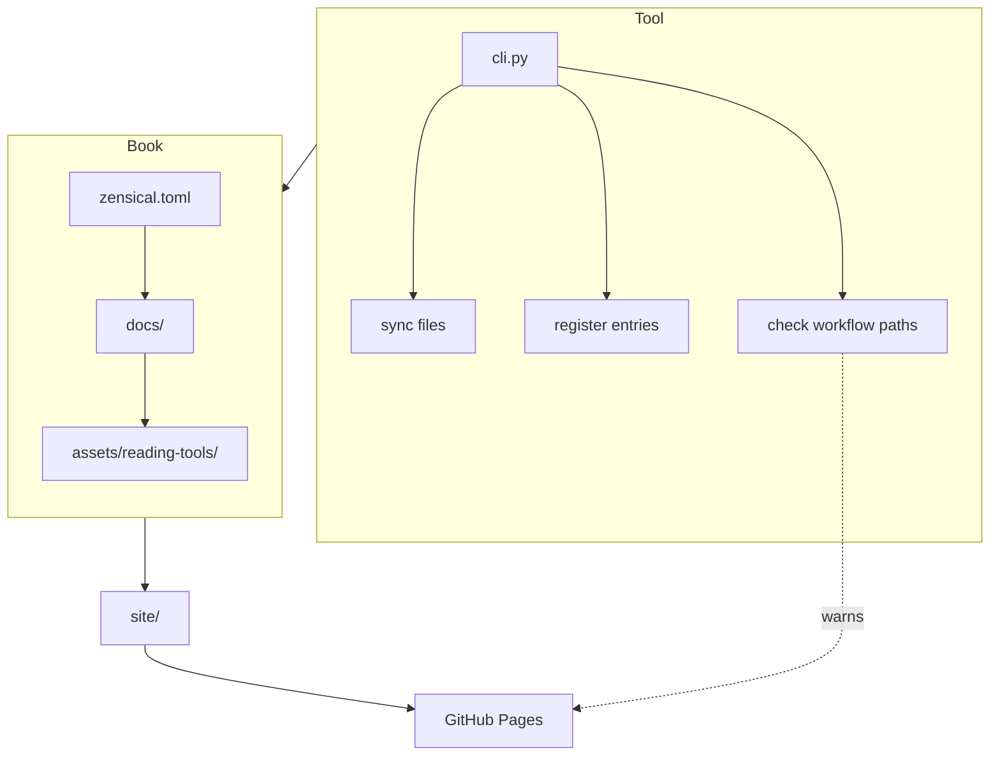

# Diagrams

Click any diagram to zoom.

## Flow

```mermaid
flowchart LR
    A[zensical.toml] --> B[fix-zensical]
    B --> C[copy assets into docs/assets/reading-tools]
    B --> D[register extra_css / extra_javascript]
    C --> E[zensical build]
    D --> E
    E --> F[GitHub Pages]
```

## Sequence

```mermaid
sequenceDiagram
    participant CI as docs workflow
    participant FZ as fix-zensical
    participant ZB as zensical build
    participant GP as GitHub Pages
    CI->>FZ: run
    FZ-->>CI: assets + config updated
    CI->>ZB: build
    ZB-->>CI: site/
    CI->>GP: deploy
```

## A larger one

```mermaid
flowchart TD
    subgraph Book
        direction TB
        cfg[zensical.toml] --> docs[docs/]
        docs --> assets[assets/reading-tools/]
    end
    subgraph Tool
        cli[cli.py] --> sync[sync files]
        cli --> reg[register entries]
        cli --> wf[check workflow paths]
    end
    Tool --> Book
    Book --> site[site/]
    site --> pages[GitHub Pages]
    wf -. warns .-> pages
```
